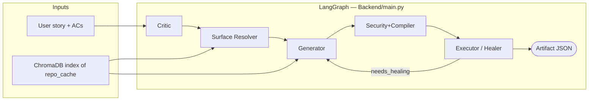

# Sentinel-QA

**Agentic QA pipeline for HPE-style API security and functional attestation.**  
Given a user story, acceptance criteria, and an indexed codebase, Sentinel-QA produces **grounded test cases**, **OWASP-aligned adversarial variants**, **runnable pytest**, and a **categorized execution report** — with honest **coverage gaps** when the spec outruns the code.

The reference application under test is [**Smart Task Manager**](Backend/repo_cache/README.md) (FastAPI + SQLAlchemy + React), vendored under `Backend/repo_cache/`. A separate **React reviewer UI** is in development; see [`sentinel-qa-architecture.md`](sentinel-qa-architecture.md) for the planned SPA + API shim. **This repository is the LangGraph backend** (agents, RAG, compiler, executor).

---

## What it does (one paragraph)

1. **Critic** — turns prose ACs into atomic requirements, ambiguity scores, and OWASP-linked risks.  
2. **Surface Resolver** — binds each requirement to a real code surface (`BACKEND_API`, `NOT_IMPLEMENTED`, …) and a **defense kind** for inverted security stories.  
3. **Generator** — RAG over ChromaDB; emits `test_suite` + `coverage_gaps` with file citations.  
4. **Security+Compiler** — clones functional tests into payload-driven adversarial cases; writes `test_sentinel_api_generated.py`.  
5. **Executor** — runs pytest against a live API (`SENTINEL_BASE_URL`); records verdicts; optional **heal loop** back to Generator; publishes **security posture** and **test suite summary by category**.

---

## Pipeline (POST_CODE)



| Mode | Command | What runs |
|------|---------|-----------|
| **POST_CODE** (default) | `python main.py post_code <story>` | Full graph: generate, compile, execute, heal (if configured). Requires Chroma ingest + live API for meaningful execution. |
| **PRE_CODE** | `python main.py --mode pre_code <story>` | Critic through Compiler; **no pytest execution**. Saves a Phase-1 snapshot for later drift comparison. |

**Entry point:** `Backend/main.py` only. Story keys come from `Backend/samples/sample_stories.py`.

```bash
cd Backend
python main.py --mode post_code search
python main.py lifecycle          # post_code is default
```

---

## Sample stories

| Key | Story ID | Intent |
|-----|----------|--------|
| `filter` | US-001 | Functional — client-side filter behavior |
| `lifecycle` | LIFE-001 | **State-transition** — CRUD + soft-delete on `/tasks/{task_id}` |
| `org` | ORG-001 | Functional — organization create (often thin / not in app) |
| `login` | AUTH-001 | Security anti-patterns → defense confirmation (A07, A03) |
| `search` | SEARCH-001 | Injection / search surface (A03) |
| `perms` | AUTHZ-001 | IDOR / access control (A01) — see [known limits](#known-limitations) |
| `ratelimit` | RATELIMIT-001 | Rate limit story (often honest empty in repo_cache) |
| `dataexport` | DATAEXP-001 | Data exposure anti-patterns |
| `taskshare` | TASK-002 | Public share links (often `NOT_IMPLEMENTED`) |

Default CLI story: `taskshare`.

---

## Quick start

### 1. Prerequisites

- **Python 3.10+**
- **Google Cloud** project with Vertex AI enabled
- **ADC:** `gcloud auth application-default login` (or `GOOGLE_APPLICATION_CREDENTIALS`)
- For execution: **target API** running (see [Run the app under test](#run-the-app-under-test))

### 2. Install (Backend)

```powershell
cd Backend
python -m venv venv
.\venv\Scripts\activate
pip install -r requirements.txt
pip install "tree-sitter>=0.23.0" "tree-sitter-language-pack>=0.4.0"
```

AST chunking **requires** `tree-sitter-language-pack`. Without it, ingest silently falls back to line-based chunks (worse citations).

### 3. Configure environment

```powershell
copy .env.example .env
```

Minimum:

| Variable | Purpose |
|----------|---------|
| `VERTEX_AI_PROJECT_ID` | GCP project (no default — fail-fast if missing) |
| `VERTEX_AI_LOCATION` | e.g. `us-central1` or `global` for preview models |
| `SENTINEL_LLM_MODEL` | Optional; default `gemini-2.5-flash` |

For **POST_CODE execution**:

| Variable | Purpose |
|----------|---------|
| `SENTINEL_BASE_URL` | Live API origin, e.g. `http://127.0.0.1:8000` |
| `SENTINEL_TEST_BEARER_TOKEN` | JWT from `POST /login` or `POST /register` |
| `SENTINEL_EXECUTOR_RUN_PYTEST` | `1` (default) to run generated pytest; `0` to skip |
| `SENTINEL_COMPILER_MAX_TESTS_PER_FILE` | Cap compiled tests (default `80`; use `25` for demos) |

Full list: [`Backend/.env.example`](Backend/.env.example).

### 4. Index the codebase (RAG)

From `Backend/`:

```powershell
python -m database.ingest repo_cache --reset
```

- **AST chunking** (Python, JS, JSX, TS, TSX) when tree-sitter is installed; else line-based fallback.  
- Embeddings: **Jina code embeddings** → `chroma_data/` (or `CHROMA_PERSIST_DIR`).  
- Optional sync: `database/github_sync.py` for remote repo → `repo_cache/`.

### 5. Run the app under test

In a second terminal:

```powershell
cd Backend\repo_cache
python -m venv venv
.\venv\Scripts\activate
pip install -r requirements.txt
copy .env.example .env
uvicorn main:app --reload --port 8000
```

Obtain a token (example):

```powershell
curl -X POST http://127.0.0.1:8000/register -H "Content-Type: application/json" -d "{\"email\":\"demo@example.com\",\"password\":\"Secret1\"}"
```

Paste `access_token` into `Backend/.env` as `SENTINEL_TEST_BEARER_TOKEN`.

### 6. Run Sentinel-QA

```powershell
cd Backend
$env:SENTINEL_RAG_MODE = "standard"
python main.py --mode post_code search
```

Wall time is often **10–25 minutes** per story (LLM + pytest + optional heal). Use `SENTINEL_COMPILER_MAX_TESTS_PER_FILE=25` for faster demos.

---

## RAG modes (`SENTINEL_RAG_MODE`)

| Mode | Use when |
|------|----------|
| **`standard`** (default) | Daily runs — multi-query retrieval into labeled buckets (router / schema / model / frontend / api_client). |
| **`naive`** | Fast smoke only — **do not trust coverage-gap output** (empty buckets look like misses). |
| **`full`** | Evaluation — adds cross-encoder reranker; very slow on CPU. |

---

## Agents (responsibilities)

| # | Agent | Module | Output |
|---|--------|--------|--------|
| 1 | **Critic** | `agents/critic.py` | `validated_requirements`, `security_risks`, ambiguity flags |
| 1.5 | **Surface Resolver** | `agents/surface_resolver.py` | `surface_map` — per-REQ `SurfaceState`, endpoints, `threat_class`, `defense_kind` |
| 2 | **Generator** | `agents/generator.py` | `test_suite`, `coverage_gaps`; Rule 11 binds tests to `surface_map` |
| 3 | **Security+Compiler** | `agents/security_compiler.py` | Adversarial `TestCase` rows + `workspace/runs/.../test_sentinel_api_generated.py` |
| 4 | **Executor** | `agents/executor.py` | `logs`, `suggested_patches`, `metadata` (posture, suite quality, **test_suite_summary**) |

**Heal loop:** `needs_healing` → Generator when functional failures, vulnerabilities, or errors remain and heal budget allows (`heal_attempts` / `max_heal_attempts` on `ProjectState`).

---

## Layer A — Surface map and defenses

Stories that describe **insecure** behavior are translated into **defense-confirming** tests:

| `ThreatClass` | Meaning |
|---------------|---------|
| `DEFENSIVE_NORMAL` | Test the feature as specified |
| `DEFENSIVE_INVERTED` | Story asks for bad behavior; test that the **inverse** defense holds |
| `NON_FUNCTIONAL` | Cross-cutting; often `NEEDS_CLARIFICATION` |

| `DefenseKind` | Typical assertion shape |
|---------------|-------------------------|
| `INPUT_REJECTION` | 4xx on bad input |
| `OUTPUT_REDACTION` | 200 + forbidden fields absent |
| `IMPLICIT_FILTER` | 200 + peer data not leaked (404 on IDOR) |
| `ERROR_SANITIZATION` | No stack/SQL in errors |
| `TRANSPORT` | HTTPS / redirect policy |

Generator **Rule 11** drops tests that target paths outside the bound surface (honest abstention vs proxy noise).

---

## Test design and categorization

Tests carry **`test_category`** on each `TestCase`:

| Category | Role |
|----------|------|
| `positive` | Happy path / expected success |
| `negative` | Validation / controlled failure |
| `boundary` | BVA-style limits (`boundaries.py`, `boundary_value_used`) |
| `state_transition` | Multi-step workflows (`workflow_steps` in pytest template) |
| `security` | Adversarial / OWASP (`is_adversarial`, payloads from `utils/payloads.py`) |

Each `TestCase` also carries **`test_technique`** — the formal **ISTQB / ISO 29119-4** design discipline it embodies (distinct from `test_category`, which names the outcome class). Inferred from category + shape when the LLM omits it:

| `test_technique` | Discipline |
|------------------|-----------|
| `equivalence_partition` | One representative test per input class (`valid`, `invalid-empty`, `invalid-type`, `auth-missing`, …); the class is recorded in `equivalence_class` |
| `boundary_value` | Value at/adjacent to a limit (BVA) |
| `decision_table` | One row of a condition→action table (opportunistic — multi-condition stories) |
| `state_transition` | Ordered multi-step workflow (`workflow_steps`) |
| `requirements_based` | Direct AC restatement, no sharper technique |
| `security_adversarial` | Attack / abuse case |

After execution, **`test_suite_summary`** rolls up planned vs executed per category **and per technique** (`by_technique`), plus `equivalence_partitions` (req → class → test ids), `by_owasp`, and `by_defense_kind` — surfaced in the JSON artifact and CLI.

---

## Output artifacts

Each POST_CODE run writes:

**`outputs/exec-demo-<story>-post_code-<timestamp>.json`** (repo root, gitignored)

| Top-level field | Meaning |
|-----------------|--------|
| `run_validity` | **Check this FIRST.** `OK`, `TARGET_UNREACHABLE` (app down — posture suppressed), `FUNCTIONALLY_UNRELIABLE` (failures are mostly test defects) |
| `coverage_quality` | Trusted only when `run_validity == OK`: `ATTESTABLE`, `INSUFFICIENT`, `NO_TESTS_GENERATED`, `ALL_SKIPPED`, `NO_RISKS_PREDICTED` |
| `suite_quality` | Deprecated alias of `coverage_quality` (one release) |
| `attestation_banner` | Human-readable warning when `run_validity != OK` |
| `test_suite_summary` | **By category / technique / OWASP / defense_kind** + `equivalence_partitions` + slim `tests_by_category` drill-down |
| `logs_detail` | Per-test final-cycle slice (test_id, status, verdict, evidence) — traceable verdicts |
| `sast_summary` | **Static** analysis (Bandit) of the target source — separate bucket, never merged into dynamic posture, never auto-healed (`SENTINEL_SAST=0` to skip) |
| `validated_requirements` | Critic output |
| `security_risks` | OWASP mapping |
| `test_suite_size` | Total tests after compiler |
| `coverage_gaps` | Spec claims not grounded in code |
| `logs_summary` | Final heal cycle only (passed / failed / error / skipped) |
| `drift_report` | PRE_CODE vs POST_CODE diff when Phase-1 snapshot exists |
| `metadata` | `security_posture`, pytest paths, compiler caps, quarantined patches, … |

**Generated pytest:** `Backend/workspace/runs/run_<utc>/test_sentinel_api_generated.py` (gitignored).

**Phase bridge:** `Backend/state/phase1_snapshots/` — PRE_CODE snapshots for drift on the next POST_CODE run.

---

## Shared state (`ProjectState`)

Defined in [`Backend/state/project_state.py`](Backend/state/project_state.py).

Key fields: `user_story`, `acceptance_criteria`, `surface_map`, `test_suite`, `coverage_gaps`, `logs`, `suggested_patches`, `heal_attempts`, `metadata`.

Each **`TestCase`** includes `action`, `input_data`, `expected_status_code`, `source_refs`, `test_category`, optional `workflow_steps`, and adversarial fields (`payload`, `owasp_category`, `bound_method`, `bound_path`, …).

Each **`ExecutionLog`** includes `status`, `verdict` (`resilient` / `vulnerable` / `off_target` / `inconclusive` / `n/a`), and legacy `passed` / `is_vulnerable` for dashboards.

---

## Repository layout

```
HPE Project/
├── README.md                          # This file
├── sentinel-qa-architecture.md        # Planned React reviewer UI (separate track)
├── docs/
│   └── design-notes/
│       └── idor-path-template-tests.md
├── outputs/                           # Run artifacts (gitignored)
└── Backend/
    ├── main.py                        # LangGraph entry + artifact dump
    ├── bootstrap.py                   # CHROMA_HOME / HF cache setup
    ├── .env.example
    ├── requirements.txt
    ├── pyproject.toml                 # ruff + pytest
    ├── agents/
    │   ├── critic.py
    │   ├── surface_resolver.py
    │   ├── generator.py
    │   ├── security_compiler.py
    │   ├── executor.py
    │   ├── pytest_runner.py
    │   ├── suite_summary.py           # Categorized rollup for artifacts
    │   └── templates/pytest_api.jinja2
    ├── state/                         # Pydantic models
    ├── database/                      # ingest, vector_store, ast_chunker, reranker
    ├── samples/sample_stories.py      # CLI story registry
    ├── utils/                         # llm, payloads, boundaries, placeholders
    ├── phase_bridge/                    # Phase-1 snapshots + drift_report
    ├── repo_cache/                    # App under test (FastAPI + React)
    ├── tests/                         # Unit tests
    ├── workspace/                     # Generated pytest runs (gitignored)
    ├── chroma_data/                   # Vector DB (gitignored)
    └── cloud/                         # Docker / publish helpers (optional)
```

---

## Development

### Lint and test

From `Backend/`:

```bash
ruff check .
pytest
```

CI (`.github/workflows/ci.yml`): **ruff** on `main`, then **pytest** with cached pip/HF models.

### Logging

`SENTINEL_LOG_LEVEL` (e.g. `INFO`, `WARNING`). Pipeline uses `logging` with timestamps in `main.py`.

---

## Known limitations

| Area | Status |
|------|--------|
| **IDOR / two-user fixtures** | `perms` may report `INSUFFICIENT` — path templates need peer task seeding. Design: [`docs/design-notes/idor-path-template-tests.md`](docs/design-notes/idor-path-template-tests.md). |
| **Pinpoint line citations** | Range buckets (`schemas.py:50-86`) are reliable; single-line refs in LLM prose may drift ±few lines. |
| **Heal loop cost** | Retries Generator; cap `max_heal_attempts` and compiler size for demos. |
| **Resilience %** | Excludes skipped/errored adversarial tests from denominator — read `errored` in posture. |
| **Features absent in app** | `org`, `ratelimit`, `taskshare` often yield honest empty or thin suites — by design. |
| **Reviewer UI** | Not in this repo; backend JSON contract is stable for [`sentinel-qa-architecture.md`](sentinel-qa-architecture.md). |

---

## Security note

Payloads in `utils/payloads.py` are **canonical test strings** for authorized security evaluation in isolated environments. Do not point Sentinel at production systems without scope and approval.

---

## License / attribution

HPE internship / academic project context. Smart Task Manager sample app lives under `Backend/repo_cache/` with its own README.
