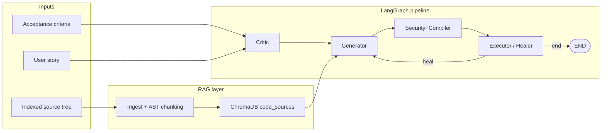

# Sentinel-QA (HPE Project)

**Sentinel-QA** is a LangGraph-based pipeline that turns a **user story** and **acceptance criteria** into **grounded test cases** and **security-oriented adversarial variants**, using **retrieval-augmented generation (RAG)** over your application’s source code. A shared **Pydantic** state object flows through every node so each agent reads and writes structured fields (requirements, risks, tests, execution logs, patches).

The project targets a **FastAPI + SQLAlchemy + React** style app (often mirrored under `Backend/repo_cache/` for indexing). The **Generator** is designed to cite real files and line ranges from ChromaDB chunks; the **Security+Compiler** agent (`security_compiler`) mutates functional tests using a payload library keyed to OWASP categories the **Critic** actually flagged, and will materialize runnable pytest files for the Executor (see `Backend/docs/SECURITY_COMPILER_IMPLEMENTATION_PLAN.md`).

---

## Architecture at a glance



- **Full graph** (`Backend/main.py`): **Critic → Generator → Security+Compiler → Executor**, with a conditional edge from **Executor** back to **Generator** when healing is needed (`needs_healing`).
- **Two-agent smoke** (`Backend/run_critic_generator.py`): **Critic → Generator** only (no Security+Compiler / Executor), useful for fast iteration and LLM cost control.
- **Three-agent smoke** (`Backend/run_three_agents.py`): **Critic → Generator → Security+Compiler** — same as above plus Jinja/pytest file under `workspace/runs/…` (needs `httpx`, `Jinja2`; API only required if you later `pytest` the file).

---

## Repository layout

| Path | Role |
|------|------|
| `Backend/main.py` | Compiles and runs the **four-node** graph (organization sample by default). |
| `Backend/run_critic_generator.py` | **Critic → Generator** entry point with CLI (`--story`, sample keys). |
| `Backend/run_three_agents.py` | **Critic → Generator → Security+Compiler** (no Executor); prints compiler metadata and generated pytest path. |
| `Backend/agents/` | **critic.py**, **generator.py**, **security_compiler.py**, **executor.py** — LangGraph node functions. |
| `Backend/state/` | **Pydantic** models: `ProjectState`, `ValidatedRequirement`, `TestCase`, `SecurityRisk`, `CoverageGap`, `ExecutionLog`, `Patch`. |
| `Backend/database/` | **vector_store.py** (Chroma + embeddings + RAG modes), **ast_chunker.py**, **ingest.py**, **reranker.py**, **github_sync.py**. |
| `Backend/utils/` | **llm.py** (Vertex AI / Gemini + retries), **payloads.py**, **boundaries.py**, etc. |
| `Backend/bootstrap.py` | Single place to set **CHROMA_HOME**, **HF_HOME**, ONNX and sentence-transformers caches before heavy imports. |
| `Backend/samples/` | Bundled sample stories used by `main.py` and `run_critic_generator.py`. |
| `Backend/repo_cache/` | Typical clone target for the app under test (when using Git sync or manual copy). |
| `outputs/` | Optional local transcripts; directory is gitignored. |

---

## How it works (end to end)

### 1. Index the codebase (RAG)

Before the **Generator** can ground tests in real code, chunks must exist in ChromaDB:

1. Ensure dependencies and env (see [Setup](#setup)).
2. From `Backend/`:

   ```bash
   python -m database.ingest path/to/source/root --reset
   ```

   - **AST-aware chunking** (`tree-sitter` + `tree-sitter-language-pack`) splits Python / JS / JSX / TS / TSX on syntactic boundaries when grammars are available; otherwise the pipeline falls back to line-based chunking.
   - Embeddings use **Jina code embeddings** (configurable via env); vectors persist under `chroma_data/` (or `CHROMA_PERSIST_DIR`).

Optional: **`database/github_sync.py`** can keep `repo_cache` in sync with a remote repository for continuous indexing.

### 2. Run the graph

- **Smoke (two agents):**

  ```bash
  cd Backend
  python run_critic_generator.py
  python run_critic_generator.py --story org
  ```

- **Full pipeline (four agents):**

  ```bash
  cd Backend
  python main.py
  ```

`ProjectState` is created with `user_story`, `acceptance_criteria`, and optional `story_title` / `story_id` / `module`, then passed to `graph.invoke(...)`.

### 3. What each agent does

| Agent | Module | Responsibility |
|-------|--------|----------------|
| **Critic** | `agents/critic.py` | Normalizes the story into **`validated_requirements`** (IDs, ambiguity scores, OWASP tags, atomic acceptance criteria) and emits **`security_risks`** (OWASP-linked rationale). Uses the LLM; does not run RAG over source code. |
| **Generator** | `agents/generator.py` | For each requirement, calls **`query_source_context`** (Chroma multi-query + route intent) to build a vertical slice (router, schema, model, frontend, API client snippets). Invokes the LLM to produce **`test_suite`** entries and **`coverage_gaps`** where the spec outruns retrieved code. |
| **Security+Compiler** | `agents/security_compiler.py` | Does **not** invent new OWASP risks. Expands **`is_adversarial=True`** cases from Critic risks + **`get_payloads`**, then writes **`workspace/runs/run_<timestamp>_utc/test_sentinel_api_generated.py`** (Jinja2 + **httpx** against **`SENTINEL_BASE_URL`**) after a **`py_compile`** gate. See `Backend/docs/SECURITY_COMPILER_IMPLEMENTATION_PLAN.md`. |
| **Executor / Healer** | `agents/executor.py` | Intended to **run** each test (HTTP/browser), record **`ExecutionLog`**, classify pass/fail vs resilient/vulnerable for adversarial cases, and optionally propose **`Patch`** objects via LLM + RAG on failure. Today ships with a **`_default_runner`** stub that does not execute a real app — replace with a Playwright/httpx runner for production. |

**Heal loop:** `needs_healing` routes back to **Generator** when failures or vulnerabilities exceed policy, subject to `heal_attempts` / `max_heal_attempts` on `ProjectState`.

### 4. Retrieval modes (`SENTINEL_RAG_MODE`)

Controlled in **`database/vector_store.py`** via `resolve_rag_mode()`:

| Mode | Behavior |
|------|----------|
| **`standard`** (default) | Multi-query expansion into labeled buckets (router, schema, model, frontend, API client). No cross-encoder reranker. Balanced for daily use. |
| **`naive`** | Single merged query; fast, but buckets used by coverage-gap logic are empty by design — can produce **misleading coverage-gap noise** unless you know why. |
| **`full`** | Multi-query + optional cross-encoder reranker; highest retrieval cost (especially on CPU). |

See **`Backend/.env.example`** for all tunables (embed batch size, reranker flags, Chroma paths, Vertex settings).

---

## Shared state (`ProjectState`)

The graph is typed on **`ProjectState`** (`Backend/state/project_state.py`). Important fields:

- **Inputs:** `user_story`, `acceptance_criteria`, `story_title`, `story_id`, `module`
- **Critic output:** `validated_requirements`, `security_risks`
- **Generator output:** `test_suite`, `coverage_gaps`
- **Security+Compiler output:** extends `test_suite` with adversarial cases (and, when implemented, writes generated test files to `workspace/`)
- **Executor output:** `logs` (`ExecutionLog`), `suggested_patches` (`Patch`), `metadata` (e.g. security posture), `heal_attempts`

Each **`TestCase`** includes human-readable `action` / `expected_result`, structured expectations (`expected_status_code`, `expected_json_keys`, …), **`source_refs`** (file:line citations from RAG), and adversarial fields (`is_adversarial`, `payload`, `owasp_category`, …).

---

## Setup

1. **Python** 3.10+ recommended (matches `tree-sitter-language-pack` wheel support in docs).

2. **Install dependencies** (from `Backend/`):

   ```bash
   python -m venv .venv
   .venv\Scripts\activate   # Windows
   pip install -r requirements.txt
   ```

3. **Configure Vertex AI** (required for Critic / Generator / Executor LLM paths):

   - Copy **`Backend/.env.example`** → **`.env`** and set at least:
     - `VERTEX_AI_PROJECT_ID`
     - `VERTEX_AI_LOCATION` (e.g. `global` for some Gemini 3.x preview models — follow Google’s docs for your chosen model)
   - Authenticate with **Application Default Credentials**, e.g. `gcloud auth application-default login`, or set `GOOGLE_APPLICATION_CREDENTIALS` to a service account JSON file.

4. **Index source** (see §1 above).

5. **Logging:** `run_critic_generator.py` calls `logging.basicConfig`; override verbosity with `SENTINEL_LOG_LEVEL` (e.g. `INFO`, `WARNING`).

---

## Linting and tests

From `Backend/`:

```bash
ruff check .
pytest
```

`pyproject.toml` configures **ruff** and **pytest** (`testpaths = ["tests"]`). Add a `tests/` package when you introduce automated tests.

---
